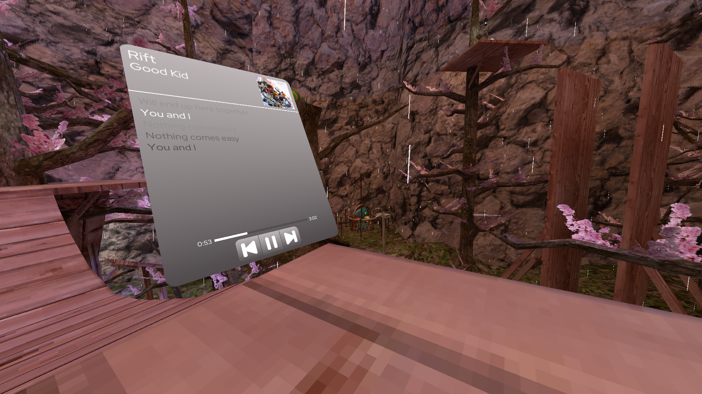
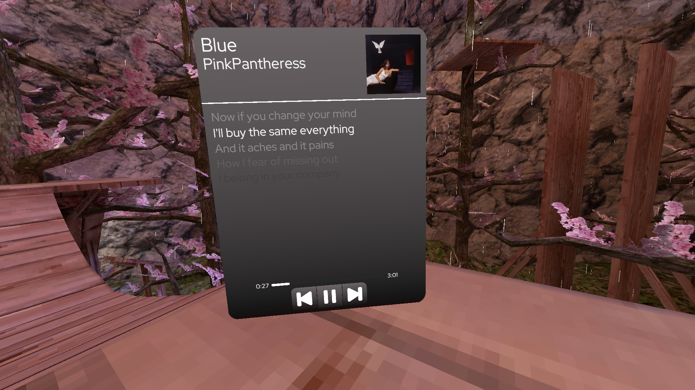

# 🎧 ChqserMedia

**ChqserMedia** is a sleek, modern wrist-based media controller designed for immersive environments. It provides real-time control and visualization of your currently playing media—right on your wrist.

Built with a focus on minimalism and usability, ChqserMedia blends seamlessly into your UI while delivering essential playback information at a glance.

---

## ✨ Features

* 🎵 **Now Playing Display**

  * Song title
  * Artist name
  * Album thumbnail

* 🕒 **Live Timestamp**

  * Current playback position
  * Smoothly updating progress

* 📜 **Dynamic Lyrics**

  * Synced, scrolling lyrics
  * Smooth transitions based on playback timing

* 🎛️ **Media Controls**

  * Play / Pause
  * Skip / Previous
  * Real-time interaction

* 🎨 **Sleek UI Design**

  * Clean, modern wrist-mounted interface
  * Gradient-based visuals
  * Optimized for readability and aesthetics

---

## 🧠 Concept

ChqserMedia is designed to feel like a natural extension of the user—especially in VR or immersive setups. Instead of pulling up bulky menus, your media is always accessible in a compact, elegant wrist interface.

---

## 🛠️ Tech Stack

* Unity (UI System / World Space Canvas)
* C#
* AssetBundles (for modular UI & assets)
* Optional native integrations (e.g., Windows media APIs)

---

## 📦 Installation

1. Download or clone the repository:

   ```bash
   git clone https://github.com/lyfedev-csharp/ChqserMedia.git
   ```

2. Import into your Unity project.

3. Add the **ChqserMedia prefab** to your wrist or player rig.

4. Configure:

   * Media source (local / API / system media)
   * Lyrics provider (if applicable)
   * UI settings (colors, gradients, layout)

---

## ⚙️ Configuration

Key configurable elements:

* **UI Theme**

  * Gradient colors
  * Opacity
  * Corner rounding

* **Lyrics Behavior**

  * Scroll speed
  * Sync offset
  * Font & spacing

* **Media Integration**

  * System media session
  * Custom audio manager
  * Third-party APIs

---

## 📸 Preview




---

## 🚀 Roadmap

* [ ] Spotify integration

---

## 🤝 Contributing

Contributions are welcome. Feel free to open issues or submit pull requests to improve functionality, performance, or design.

---

## 📄 License

This project is licensed under the MIT License.
Feel free to use, modify, and distribute.

---

## 💡 Notes

ChqserMedia is built for performance and visual clarity—keeping distractions low while giving you full control over your media experience.

---

* a **logo/banner for the README**
* a **GIF mockup of the wrist UI**
* or tailor this README specifically for **VRChat / Gorilla Tag / BepInEx setup**
